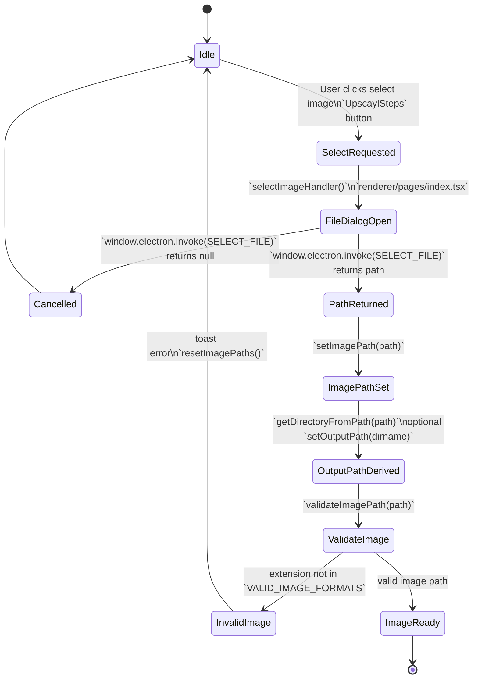
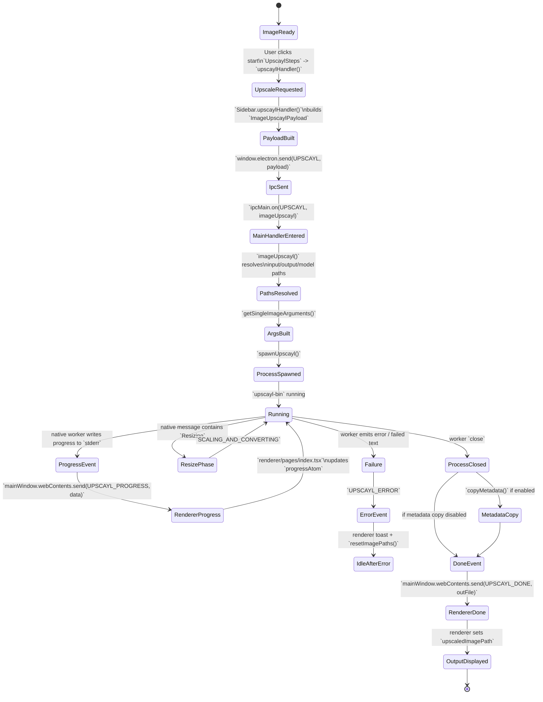

# Upscayl Architecture Analysis

## Purpose

This document analyzes the current Upscayl repository as a reference architecture for a future desktop application that can work with seismic 2D images and SEG-Y-derived slices. The goal is not just to describe the codebase, but to extract the parts that are reusable and the parts that do not translate cleanly to scientific seismic data.

This analysis is grounded in:

- the local `upscayl/upscayl` repository
- the native backend repository referenced by the project: `upscayl/upscayl-ncnn`
- the local SEG-Y specifications `segy_rev1.pdf` and `segy_rev2_0-mar2017 (1).pdf`

## Executive Summary

Upscayl is a local-first desktop application built as an Electron shell around a Next.js/React renderer and a packaged native inference worker. There is no server-side backend in the normal web-application sense. The "backend" is the Electron main process plus a spawned OS-native CLI, `upscayl-bin`, that runs image super-resolution models through NCNN and Vulkan.

Architecturally, the application is clean and practical:

- the renderer owns interaction, local UI state, and progress display
- the Electron main process owns file dialogs, process orchestration, IPC, and packaged resource resolution
- the native worker owns actual image inference

Algorithmically, Upscayl is not "just resizing." Its main value comes from learned image super-resolution models in the Real-ESRGAN family. Classical resize filters exist in the native backend, but they are auxiliary tools. The primary enhancement step is model-based inference that reconstructs plausible high-frequency detail from low-resolution raster images.

That distinction matters for seismic work. Upscayl's current technique maps well to display-oriented raster enhancement of exported seismic images, but it does not directly map to scientific treatment of SEG-Y trace data. For SEG-Y, "upscaling" can mean at least four different things:

1. numeric representation expansion, such as 8-bit to 16-bit amplitude storage
2. intra-trace sample densification, such as 1000 samples per trace to 2000
3. inter-trace spatial densification, such as 25 m trace spacing to 12.5 m
4. display-only raster enhancement of rendered seismic sections

Those are different problems with different scientific risks. Only the fourth one is close to what Upscayl currently does.

## Upscayl Stack Analysis

### Desktop and Runtime

- Desktop shell: Electron
- Main-process bootstrap: `electron/index.ts`
- Main window creation: `electron/main-window.ts`
- Preload bridge: `electron/preload.ts`
- Packaging and distribution: `electron-builder`
- Packaged binaries: `resources/linux/bin/upscayl-bin`, `resources/mac/bin/upscayl-bin`, `resources/win/bin/upscayl-bin.exe`
- Packaged model weights: `resources/models/*.param` and `resources/models/*.bin`

### Frontend

- Renderer framework: Next.js with React
- Main page entrypoint: `renderer/pages/index.tsx`
- State management: Jotai
- Persisted UI state: `atomWithStorage` in `renderer/atoms/user-settings-atom.ts`
- Styling/UI libraries: Tailwind CSS, DaisyUI, Lucide, Radix-style UI helpers

### Native Inference Backend

- Native worker: `upscayl-bin`
- Upstream implementation: `upscayl/upscayl-ncnn`
- Core inference stack: NCNN + Vulkan
- Model family basis: Real-ESRGAN lineage

### IPC and Shared Contracts

- IPC command surface: `common/electron-commands.ts`
- Shared payload contracts: `common/types/types.d.ts`
- CLI argument construction: `electron/utils/get-arguments.ts`

## Frontend Architecture

The renderer is a desktop UI, not a thin client for a remote service. It performs all user interaction and orchestrates local work through IPC.

### Primary Responsibilities

- image or folder selection
- drag-and-drop image ingestion
- clipboard image paste support
- model selection
- single image, batch, and double-pass modes
- output folder selection
- settings management
- progress and error display
- before/after preview of upscaled results

### Main Renderer Entry Point

`renderer/pages/index.tsx` is the orchestration hub. It manages:

- selected image path
- batch folder path
- output path
- upscaled output path
- dimensions for display and scale estimation
- event listeners for progress, warnings, errors, completion, and metadata failures

It listens to Electron events such as:

- `UPSCAYL_PROGRESS`
- `FOLDER_UPSCAYL_PROGRESS`
- `DOUBLE_UPSCAYL_PROGRESS`
- `UPSCAYL_ERROR`
- `UPSCAYL_WARNING`
- `UPSCAYL_DONE`
- `FOLDER_UPSCAYL_DONE`
- `DOUBLE_UPSCAYL_DONE`

### Sidebar Workflow

`renderer/components/sidebar/index.tsx` and `renderer/components/sidebar/upscayl-tab/upscayl-steps.tsx` implement the operational workflow:

1. choose file or folder
2. choose model
3. choose output path
4. start upscaling

The sidebar then builds one of the shared payloads:

- `ImageUpscaylPayload`
- `BatchUpscaylPayload`
- `DoubleUpscaylPayload`

and sends the matching IPC command to the main process.

### Persistent Settings

`renderer/atoms/user-settings-atom.ts` shows the renderer-side configuration model. Persisted values include:

- selected model
- scale
- GPU ID
- output image format
- whether double upscaling is enabled
- whether batch mode is enabled
- output folder memory
- compression
- overwrite mode
- tile size
- TTA mode
- custom width
- metadata copy
- auto-update preference
- lightweight user stats

This is a good pattern for a desktop scientific app: keep user workflow preferences local and explicit.

## Main-Process and Runtime Architecture

The Electron main process is the control plane for local execution.

### Bootstrap

`electron/index.ts` performs:

- Electron/Next bootstrap via `electron-next`
- main window creation
- file protocol registration
- packaged resource path logging
- IPC registration
- updater initialization
- limited bookmark/security-scoped folder handling for Mac App Store builds

### Main Window

`electron/main-window.ts` creates a desktop window and loads:

- `http://localhost:8000` in development
- exported static renderer assets in packaged mode

The main window also:

- hides the menu bar
- forwards external links to the OS browser
- reads local storage for updater preferences
- sends OS information to the renderer

### Preload Bridge

`electron/preload.ts` exposes `window.electron` with:

- `send(command, payload)`
- `on(command, callback)`
- `invoke(command, payload)`
- platform access
- system info access
- app version access

This bridge is the key seam between the renderer and local execution. For a seismic app, this seam should remain narrow and explicit.

### IPC Command Surface

`common/electron-commands.ts` defines the application's internal command language. Important commands include:

- file/folder selection
- single-image upscaling
- batch upscaling
- double-pass upscaling
- open folder
- stop
- model list retrieval
- custom model folder selection
- paste image
- progress, done, warning, and error channels

This command vocabulary is one of the most reusable parts of the architecture.

## Native Backend and Algorithm Analysis

### What the Native Worker Actually Is

Upscayl's computational backend is a spawned native executable, not a JS/TS inference library. `electron/utils/spawn-upscayl.ts` simply spawns the packaged binary resolved by `electron/utils/get-resource-paths.ts`.

The worker is responsible for:

- loading the selected model
- reading image input
- running inference on GPU
- tiling when memory is constrained
- writing output images
- reporting status text back over stderr

### What Algorithm Is Being Used

Upscayl's primary upscaling technique is learned image super-resolution, not ordinary interpolation.

Evidence from the repository and the backend implementation indicates:

- the project credits Real-ESRGAN directly in `README.md`
- the native backend classes are named `RealESRGAN`
- the backend loads NCNN `.param` and `.bin` model files
- the backend enables Vulkan compute through NCNN
- the renderer exposes model choice among several packaged super-resolution models

In practical terms, the pipeline is:

1. load a pretrained image super-resolution model
2. feed a raster image into the model
3. infer a larger output image with added or reconstructed detail
4. optionally resize/convert/compress the output

This is an AI reconstruction problem, not a pure geometric scaling operation.

### Techniques Present in the Backend

### 1. Learned Super-Resolution

This is the core technique. The model family is in the Real-ESRGAN line and runs through NCNN/Vulkan. The model attempts to reconstruct plausible high-resolution image content from a lower-resolution raster input.

This is the part that makes Upscayl useful.

### 2. Tiled Inference

The backend splits large images into tiles and processes them in pieces to fit within GPU memory constraints. The UI exposes tile size because it materially affects whether inference succeeds on limited hardware.

This is a deployment technique, not a scientific technique, but it is highly reusable for large seismic rasters or slice images.

### 3. TTA Mode

The UI exposes TTA mode and the native backend contains separate preprocess and postprocess pipelines for it. Test-time augmentation is a quality/performance tradeoff mechanism during inference.

This is reusable in principle for model-based seismic inference, but only if the future seismic models are designed and validated for it.

### 4. Double Upscayl

`electron/commands/double-upscayl.ts` runs the upscaler twice. This is a simple orchestration feature:

- first pass writes the enlarged output
- second pass runs on that output again

This is not a new algorithm. It is repeated application of the same model pipeline.

### 5. Classical Resize Filters

The native CLI supports resize modes such as:

- default
- box
- triangle
- cubicbspline
- catmullrom
- mitchell
- pointsample

These come from the backend resize path and are useful for deterministic resizing. They are not the primary upscaling method in the app as wired today. They are support tools around the main model-based inference pipeline.

### 6. Bicubic Handling for Alpha and Auxiliary Resize Work

The backend source initializes bicubic interpolation layers for 2x/3x/4x operations. This is important, but it does not change the main conclusion: Upscayl's primary enhancement is learned super-resolution.

### Built-In Models

`common/models-list.ts` shows the built-in model IDs:

- `upscayl-standard-4x`
- `upscayl-lite-4x`
- `high-fidelity-4x`
- `remacri-4x`
- `ultramix-balanced-4x`
- `ultrasharp-4x`
- `digital-art-4x`

The model descriptions in `renderer/locales/en.json` indicate domain bias:

- standard and lite are generic
- remacri, ultramix, ultrasharp, and high-fidelity target natural imagery
- digital-art targets illustrations

This matters for seismic work because none of these are trained for seismic reflectivity, structure, noise, or acquisition artifacts.

## End-to-End Upscaling Flow

### Single Image Flow

1. User selects an image in the renderer.
2. The renderer validates format and computes an output directory default.
3. The sidebar assembles `ImageUpscaylPayload`.
4. The renderer sends `ELECTRON_COMMANDS.UPSCAYL`.
5. `electron/commands/image-upscayl.ts` resolves:
   - input path
   - output path
   - model path
   - output filename
   - scale/custom width
   - GPU ID
   - format/compression/tile/TTA settings
6. `electron/utils/get-arguments.ts` builds the native CLI arguments.
7. `electron/utils/spawn-upscayl.ts` spawns `upscayl-bin`.
8. The worker reports progress and errors via `stderr`.
9. The main process forwards those messages back through IPC.
10. The renderer updates progress, shows warnings/errors, and displays the final output.
11. If enabled, metadata is copied to the output after successful completion.

### Single Image State Machine: Selection and Upload

The following state machine shows the renderer-side call flow when a user selects an image for single-image upscaling.

Key functions and components in this state machine:

- `renderer/components/sidebar/upscayl-tab/upscayl-steps.tsx`
  - invokes `selectImageHandler` when the user clicks the Step 1 button
- `renderer/pages/index.tsx`
  - `selectImageHandler()`
  - `validateImagePath()`
  - `setImagePath()`
  - `setOutputPath()`
- `electron/index.ts`
  - IPC handler registration for `ELECTRON_COMMANDS.SELECT_FILE`
- `electron/commands/select-file`
  - opens the native file picker and returns the chosen path

### Single Image State Machine: Upscale Execution

The next state machine shows the full execution path after the image is already selected and the user clicks the upscale button.

Key functions and components in this state machine:

- `renderer/components/sidebar/upscayl-tab/upscayl-steps.tsx`
  - triggers the upscale button action
- `renderer/components/sidebar/index.tsx`
  - `upscaylHandler()`
  - chooses single-image path vs batch vs double-pass path
  - sends `ELECTRON_COMMANDS.UPSCAYL`
- `electron/index.ts`
  - registers `ipcMain.on(ELECTRON_COMMANDS.UPSCAYL, imageUpscayl)`
- `electron/commands/image-upscayl.ts`
  - `imageUpscayl()`
  - resolves paths and output filename
  - handles progress, close, error, and optional metadata copy
- `electron/utils/get-arguments.ts`
  - `getSingleImageArguments()`
- `electron/utils/spawn-upscayl.ts`
  - `spawnUpscayl()`
- native worker
  - `upscayl-bin`
- `renderer/pages/index.tsx`
  - receives `UPSCAYL_PROGRESS`
  - receives `UPSCAYL_ERROR`
  - receives `UPSCAYL_DONE`
  - updates progress state and output image path

### Single Image Call Flow Summary

For the single-image path, the call chain is:

1. `UpscaylSteps` button click
2. `selectImageHandler()` in `renderer/pages/index.tsx`
3. `window.electron.invoke(ELECTRON_COMMANDS.SELECT_FILE)`
4. selected path returned to renderer
5. `validateImagePath()` and output path setup
6. user clicks start
7. `Sidebar.upscaylHandler()`
8. `window.electron.send(ELECTRON_COMMANDS.UPSCAYL, payload)`
9. `imageUpscayl()` in the Electron main process
10. `getSingleImageArguments()`
11. `spawnUpscayl()`
12. `upscayl-bin` inference execution
13. progress and completion events forwarded back to renderer
14. renderer updates progress UI and displays the final output

### Batch Flow

The batch flow is similar, but:

- the input is a folder
- the main process constructs a derived output subfolder name
- the native worker is pointed at an input directory and output directory
- progress and completion are reported through folder-specific IPC events

### Double-Pass Flow

The double-pass mode:

1. runs one inference pass to produce an intermediate enlarged output
2. launches a second pass over that output
3. reports progress through a double-upscayl-specific IPC channel

This is a simple but effective orchestration pattern that may translate to multi-stage seismic workflows.

## Key Strengths of the Current Architecture

### 1. Clean Separation of Concerns

Renderer, control plane, and compute worker are distinct.

### 2. Local-First Design

No service dependency is required for core functionality.

### 3. Narrow Worker Interface

The native worker is invoked via CLI arguments. That makes it easy to swap the compute engine later if the contract stays stable.

### 4. Good Batch-Friendly UX

The application is built around artifact production and output folder workflows, which is useful for scientific processing tools.

### 5. Packaged Models and Custom Model Folder Support

The app supports both bundled models and user-provided custom models. That is directly relevant for a future seismic model registry.

## Key Constraints and Weaknesses

### 1. No Domain Awareness

The system knows images, not traces, headers, coordinates, or acquisition geometry.

### 2. Progress Parsing Is Text-Based

The UI interprets stdout/stderr-like progress strings. This is easy to implement but somewhat fragile.

### 3. Settings Are Split Across Multiple Stores

The app uses:

- renderer local storage through Jotai
- browser local storage directly in some places
- `electron-settings` in the main process

This is workable, but a scientific application will likely want a more explicit config/provenance model.

### 4. The Model Priors Are Wrong for Seismic Data

The current models are built for natural images and illustrations. They are not trustworthy for scientific reconstruction of seismic structure.

## SEG-Y Study: What a Seismic Trace Contains

The two local PDFs, `segy_rev1.pdf` and `segy_rev2_0-mar2017 (1).pdf`, make one thing very clear: a SEG-Y trace is not just an "image row" or "image column." It is a structured scientific record embedded in a larger acquisition and positioning context.

### File Structure

A SEG-Y file contains:

- a textual file header
- a binary file header
- a sequence of data traces

Each data trace contains:

- a trace header
- the trace sample data

Revision 2 adds more flexible support for:

- trace header extensions
- richer extended textual stanzas
- more numeric sample formats
- larger counters and intervals
- more explicit CRS and bin-grid metadata support

### What Is in a Trace Header

The trace header contains scientific and positional metadata, including:

- trace sequence numbers
- field record and ensemble identifiers
- trace identification code
- source and receiver coordinates
- coordinate scalar
- elevation/depth scalar
- number of samples in the trace
- sample interval for the trace
- coordinate units

The rev2 specification explicitly states that bytes 115-116 define the number of samples in the trace and bytes 117-118 define the sample interval for the trace. It also documents coordinate scaling and source/group X/Y coordinates in the standard trace header.

### What Is in the Trace Data

The trace data is the ordered sample array itself. The sample values are encoded according to the binary header's data sample format code.

Relevant points from the PDFs:

- rev1 supports IBM float, signed integers, 8-bit integer, and IEEE 32-bit float formats
- rev2 expands this further with additional integer and IEEE 64-bit support
- sample interval and number of samples are first-class concepts
- varying trace lengths are explicitly supported

In short, a seismic trace is a sampled signal plus metadata that defines what those samples mean in time, depth, space, and acquisition context.

## What "Upscaling" Means for Seismic Data

There is no single seismic equivalent of image upscaling. At least four different operations are possible, and they should not be conflated.

### A. Bit-Depth or Numeric Representation Expansion

Example:

- storing amplitude values in 16-bit form instead of 8-bit form

What it does:

- increases the number of representable numeric levels
- changes storage precision or encoding

What it does not do:

- create new information
- recover lost bandwidth
- infer new samples
- improve spatial sampling

Conclusion:

This is usually not true upscaling. If an 8-bit signal is merely rewritten as 16-bit, no real seismic detail has been created. It is closer to re-encoding than to super-resolution.

### B. Intra-Trace Sample Densification

Example:

- a trace with 1000 samples becomes a trace with 2000 samples

What it means:

- denser sampling along the time or depth axis
- equivalent to temporal or depth-axis super-resolution

Possible techniques:

- interpolation
- band-limited resampling
- model-based reconstruction
- physics-informed reconstruction

Conclusion:

This is a meaningful candidate for seismic "upscaling," but it is not the same as bit-depth expansion. It tries to infer intermediate samples between existing ones. Whether this is scientifically valid depends on signal bandwidth, aliasing, acquisition assumptions, and validation data.

### C. Inter-Trace Spatial Densification

Example:

- 25 m trace spacing to 12.5 m trace spacing
- adding new traces between existing traces in 2D
- densifying the inline/crossline grid in 3D

What it means:

- reconstructing missing traces between existing traces
- improving spatial sampling density

Possible techniques:

- classical interpolation
- dip-aware interpolation
- structure-guided interpolation
- ML-based spatial super-resolution

Conclusion:

This is probably the strongest seismic analogue to image-width or image-height upscaling. It creates new traces between existing traces rather than merely changing numeric precision.

### D. Raster Display Upscaling

Example:

- exporting a seismic section as PNG and running it through Upscayl

What it means:

- enhancing the visual appearance of a rendered image
- improving readability for display or presentation

What it does not mean:

- improving the underlying SEG-Y data
- preserving geophysical truth automatically

Conclusion:

This is the closest direct match to Upscayl's current functionality, but it is only a visualization workflow. It should be treated separately from scientific seismic processing.

### Which One Is the Real Equivalent?

The answer depends on the target product mode:

- if the target is better-looking exported seismic images, the equivalent is raster display upscaling
- if the target is more samples within a trace, the equivalent is intra-trace sample densification
- if the target is denser spatial acquisition or denser interpreted sections, the equivalent is inter-trace spatial densification

What is not a true equivalent by itself is:

- 8-bit to 16-bit conversion

That changes representation, not information content.

## Do Upscayl's Techniques Translate to Seismic Trace Upscaling?

### For Rasterized Seismic Images

Yes, with caveats.

If the input is already a raster image of a seismic section, Upscayl's architecture and algorithm class can be reused as a display-enhancement tool. The desktop workflow, batch processing pattern, model registry pattern, and renderer/main/worker split all translate well.

But the output should be treated as:

- a visualization artifact
- potentially perceptually improved
- not guaranteed to preserve scientific amplitude or structural truth

### For SEG-Y Trace Data

Not directly.

Upscayl's current approach does not understand:

- trace headers
- sample intervals
- acquisition geometry
- coordinate systems
- ensemble structure
- physical meaning of amplitudes

A Real-ESRGAN-style image prior may hallucinate plausible-looking reflectors or continuity that are not actually justified by the seismic signal. That is acceptable in a consumer image app and dangerous in a scientific interpretation workflow.

## What Would Need To Change for a Seismic App

The future application should split into distinct capability modes instead of pretending there is one generic "upscale" operation.

### Mode 1: Raster Visualization Enhancement

Input:

- PNG/JPG/TIFF seismic section or slice exports

Output:

- visually enhanced raster artifact

Use case:

- presentation
- quick interpretation aid
- report-quality images

Closest to Upscayl:

- very high

### Mode 2: Trace-Axis Sample Densification

Input:

- SEG-Y traces or extracted slices with known sample interval and count

Output:

- denser sample arrays along time/depth axis

Use case:

- denser vertical sampling
- smoother section reconstruction
- downstream analysis that expects finer sample spacing

Closest to Upscayl:

- low at the algorithm level
- medium at the orchestration level

### Mode 3: Spatial Trace Interpolation

Input:

- 2D line traces or 3D inline/crossline grids

Output:

- reconstructed traces between existing spatial positions

Use case:

- denser spatial grids
- improved slice continuity
- sparse-to-dense reconstruction

Closest to Upscayl:

- low at the current model level
- medium at the UX and execution-architecture level

## Recommended Product Framing for the Seismic Successor

The future application should preserve Upscayl's architectural shape while changing the data model and compute semantics.

Recommended high-level design:

- keep Electron or a similar desktop shell
- keep a renderer/main/worker split
- keep a narrow worker contract
- add SEG-Y ingestion and slicing as first-class capabilities
- separate visualization outputs from scientific outputs
- preserve provenance for every derived artifact

The product should expose separate operations such as:

- "Enhance Exported Seismic Image"
- "Increase Trace Sample Density"
- "Interpolate Missing Traces"

Those are not interchangeable.

## Architectural Reuse vs Required Replacement

### Reusable From Upscayl

- desktop workflow
- local-first processing
- packaged native worker model
- IPC command architecture
- batch job UX
- model selection and model packaging pattern
- progress and artifact-oriented output handling

### Must Be Replaced or Redesigned

- image-only input assumptions
- image-format validation
- output naming semantics centered on PNG/JPG/WebP
- metadata-copy assumptions borrowed from photo workflows
- natural-image super-resolution models
- progress semantics based only on image inference text streams

### High-Risk Mismatches

- perceptual detail generation can create scientifically misleading structure
- amplitude-preserving requirements are stronger in seismic than in consumer imaging
- trace and geometry metadata are part of the data, not optional attachments
- exported raster images and SEG-Y source data must never be treated as the same processing domain

## Recommended Engineering Safeguards

- never overwrite original SEG-Y input
- emit derived products separately from source data
- log the source dataset, algorithm, parameters, and model version
- preserve headers and geometry metadata when producing scientific outputs
- label display-enhanced outputs clearly as non-source artifacts
- validate any scientific reconstruction mode against higher-quality reference data where possible

## Key Takeaways

1. Upscayl is best understood as an Electron desktop orchestrator around a native AI image super-resolution worker.
2. Its core algorithm is learned image super-resolution in the Real-ESRGAN family, not classical interpolation alone.
3. The architecture is reusable for a seismic desktop application, especially the renderer/main/worker split and local-first execution model.
4. The current models and assumptions do not translate directly to SEG-Y trace processing.
5. For seismic data, "upscaling" should be split into separate concepts:
   - precision/representation expansion
   - intra-trace sample densification
   - inter-trace spatial densification
   - display-only raster enhancement
6. The meaningful scientific analogues are usually sample densification and spatial trace interpolation, not bit-depth expansion by itself.
7. A future seismic application should support both raster enhancement and SEG-Y-aware reconstruction, but it should treat them as different product modes with different algorithms and validation standards.
